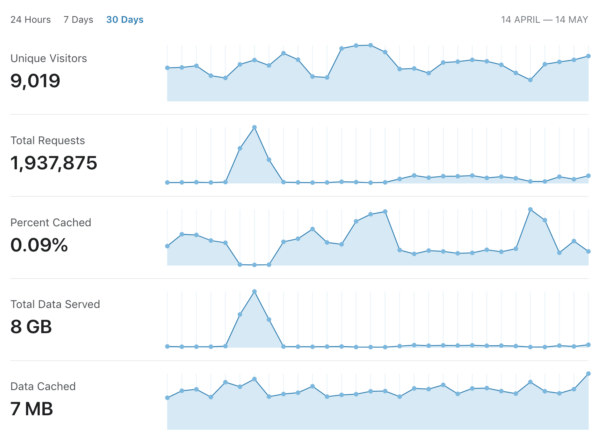

# 🍻 Official Open Brewery DB Website

The [Open Brewery DB website](https://www.openbrewerydb.org/) is an information and documentation site for the public Open Brewery DB API.

## 📦 Uses

* [Gatsby](https://www.gatsbyjs.org/)
* [MDX](https://mdxjs.com/)

## 🚀 Quickstart

Get started by running the following commands:

```bash
git clone git@github.com:chrisjm/openbrewerydb-gatsby.git
npm install
npm start
```

Visit `http://localhost:8000/` to view the app.

## 📊 Analytics



## 🤝 Contributing

For information on contributing to this project, please see the [contributing guide](CONTRIBUTING.md) and our [code of conduct](CODE_OF_CONDUCT.md).

## 🔗 Related

* [Open Brewery DB Rails API](https://github.com/chrisjm/openbrewerydb-rails-api)
* [Open Brewery DB Dataset](https://github.com/openbrewerydb/openbrewerydb)

## 👾 Community

* [Join the Newsletter](http://eepurl.com/dBjS0j)
* [Join the Discord](https://discord.gg/SHtpdEN)

## 📫 Feedback

Any feedback, please [email me](mailto:chris@openbrewerydb.org).

Cheers! 🍻
