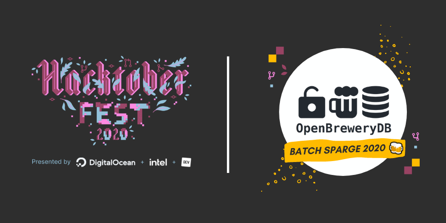

Hacktoberfest is an [event](https://hacktoberfest.digitalocean.com/) organized every October by DigitalOcean and other sponsors to help promote open source. The first 70,000 participants get a free t-shirt 👕 or a tree 🌲 planted for the eco-friendly. Open Brewery DB is participating this year by holding a couple scheduled hack-a-thon events and maybe some impromptu sessions.

## 🗓 Events

These events will be held on the [OBDB Discord server](https://discord.gg/3G3syaD).

* Sunday, Oct 11th @ 5-7pm EST / 2-4pm PST - _Kick-off & "Update Local Breweries, Get a Hacktoberfest T-Shirt"_ 
I'll demo how to update the OBDB dataset via the Github website. Afterward, we'll each update our own local breweries. You are guaranteed to make enough PRs to earn a t-shirt or tree reward after this hack-a-thon.
* Thursday, Oct 29th @ 6-8pm EST / 3-5pm PST - _"The Last Hack 🪓"_ 
If you missed the kick-off and have been pre-occupied, this is a change to submit some last-minute PRs for approval. Plus, just a general community hangout and cheers! 🍻

## 📋 FAQs

* **Do I need to sign up for Github to get a t-shirt?** Yes. DigitalOcean securely connects to your Github account via OAuth to track the PRs you've submitted and ensured they belong to valid open source projects.
* **Do I only contribute to Open Brewery DB?** No. You can contribute to any number of open-source projects. You don't even have to contribute to OBDB, but what fun would that be? 😄
* **"I'm not sure how to help." or "I've never contributed to open-source." or "I have no idea what you're talking about."** No problem! Ask away in here or send me (@chrisjm) a DM.

## ✌️ Code of Conduct

Open Brewery DB is an all-inclusive community for developers and data-nerds of all skill levels.

Please review the [OBDB Code of Conduct](https://github.com/chrisjm/openbrewerydb-gatsby/blob/master/CODE_OF_CONDUCT.md).

Email info@openbrewerydb.org if you have any feedback or questions.

### Happy Hacktoberfest! 🍻
